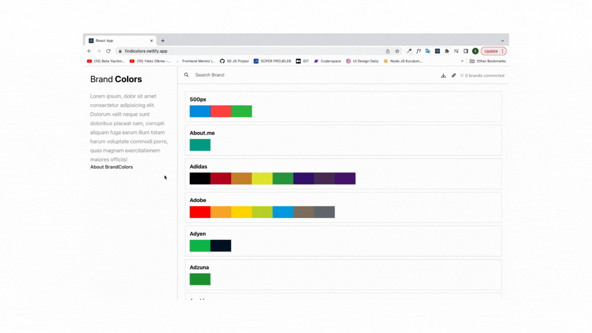

# BrandColors clone with React

In this project, I designed a BrandColors Clone project using the React library.
I used contextAPI, Sass in the project.

## Live Link of the Project

[FİNDCOLORS](https://findicolors.netlify.app/)

## Tools 🛠️

- React
- contextAPI
- Sass
  
## Badges

  
## Demo

